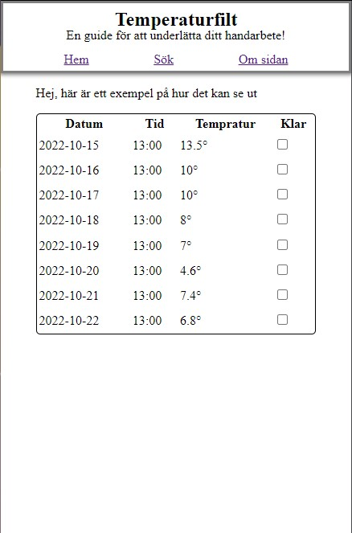

# Tempratureblanket guide 
Hi! Welcome to the code of the tempratureblanket guide, I'm glad you found your way here.

With this you will be able to search for a location and timeperiod and then get back a table of tempratures with [visualcrossing API](https://www.visualcrossing.com/weather/weather-data-services)

### Tech Stack 
- Typecript
- SASS
- Vite
- React Router
- React Snap
- Fetches weather data from [visualcrossing](https://www.visualcrossing.com/weather/weather-data-services) with REST

### Version names 
The versions are named after the Pegasus Stargate glyphs in position order. 

Subido, Bydo, Robandus, Sibbron, OnceEl, Layox and so on.

## What's next?
Features I want to add in no particular order:
- inpiration and patterns from [Ravely API](https://www.ravelry.com/groups/ravelry-api)
- Color reference for tempratures that the user can create and save
- Colorcode the table rows depending on color choosen for the temperature by the user
- Download table of data as a PDF
- English version

## Screenshots

### Bydo
First "finished" version, the most inportant functions are implemented and working.

table of data | search form
:------------:|:-----------:
 | 

### Subido
Concept, first version while working on the functions.

table of data | search form
:------------:|:-----------:
 | 
